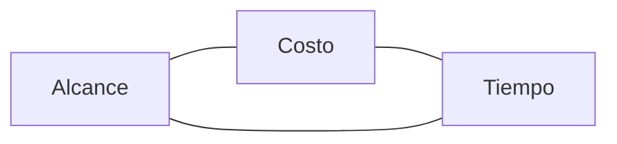
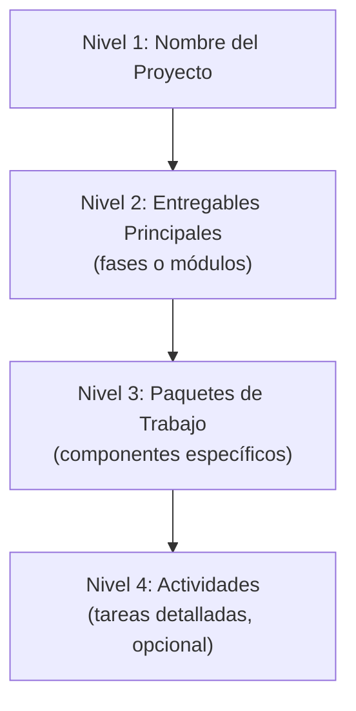
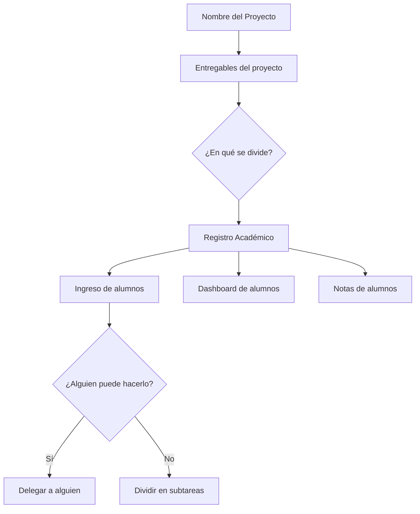

---
tags:
  - apuntes
  - duoc
  - sexto-semestre
  - gestion-de-proyectos
---

# 18 - 08 - 2026

## Triángulo de Hierro (Restricciones del Proyecto)

> Toda restricción impacta en las demás. Si cambia una, las otras dos se ven afectadas.

| Variable | Descripción |
| ---------- | ------------- |
| **Alcance** | Qué se va a construir (entregables) |
| **Costo** | Presupuesto y recursos disponibles |
| **Tiempo** | Plazos y cronograma del proyecto |

## Etapas de un Proyecto (Ciclo de Vida)

| # | Etapa | Descripción |
| --- | ------- | ------------- |
| 1 | **Inicio** | Definición del proyecto, viabilidad y acta de constitución |
| 2 | **Planificación** | EDT, cronograma, presupuesto, recursos y plan de gestión |
| 3 | **Ejecución** | Desarrollo del trabajo según lo planificado |
| 4 | **Monitoreo y Control** | Seguimiento continuo de avance, calidad y desviaciones |
| 5 | **Cierre** | Entrega formal, lecciones aprendidas y cierre administrativo |

> [!NOTE]
> Monitoreo y Control comienza en paralelo con Ejecución y continúa hasta el cierre.

## EDT (Estructura de Desglose del Trabajo)

> [!IMPORTANT]
>**¿Qué es la EDT?**
>Esquema de Desglose de Trabajo (WBS en inglés). Es todo lo que se va a construir, descomponido en partes menores.

La EDT consiste en descomponer los entregables del proyecto en una estructura jerárquica. Es una representación visual del alcance total del proyecto.

### Reglas para construir una EDT

| Regla | Ejemplo correcto | Ejemplo incorrecto |
| ------- | ------------------ | ------------------- |
| Usar **sustantivos/entregables** | Prototipo de pantallas | Diseñar pantallas |
| Cada nivel desglose más detalle | Módulo a Componente | Módulo a Módulo |
| Debe ser **exhaustiva** | Cubrir todo el alcance | Omitir entregables |
| Cada ítem tiene **un solo padre** | Responsable único | Múltiples dueños |

### Niveles de una EDT

### Ejemplo de entregables

| Categoría | Ejemplos |
| ----------- | ---------- |
| **Documentación** | Acta de constitución, plan de gestión, manuales |
| **Capacitación** | Capacitación usuario final, usuario técnico |
| **Desarrollo** | Módulos funcionales, integraciones, base de datos |
| **Infraestructura** | Servidores, entorno de producción, despliegue |
| **Marcha Blanca** | Pruebas piloto, validación con usuario real |

> [!TIP]
> **Marcha Blanca:** Prueba piloto con usuarios reales antes del lanzamiento oficial. Se asigna un equipo de acompañamiento durante el desarrollo.

## Desglose del trabajo

## Ejercicio Práctico en Clase: Caso "App FoodTruck Express"

### 1. Contexto

Una cadena de Food Trucks de comida rápida quiere lanzar una aplicación móvil para que sus clientes puedan hacer pedidos con anticipación, pagar en línea y retirar su comida sin hacer filas.

El Director del Proyecto te ha pedido armar la **Estructura de Desglose del Trabajo (EDT / WBS)** del proyecto para presentársela al inversionista.

### 2. Entregables del Proyecto

El proyecto incluye únicamente los siguientes aspectos clave:

1. **Gestión del Proyecto:** Acta Constitución del Proyecto y Plan de Trabajo.
2. **Diseño de la App:** Prototipo de pantallas y Arquitectura del Sistema.
3. **Desarrollo:**
   - Catálogo de productos y menú.
   - Pasarela de pagos (integración Webpay/Tarjetas).
   - Sistema de notificaciones ("Tu pedido está listo").
4. **Pruebas:** Reporte de pruebas funcionales y Pruebas con usuarios piloto.
5. **Lanzamiento:** Cuentas de usuario configuradas y Publicación en tiendas (App Store / Play Store).

### 3. Instrucciones

En parejas o máximo 3 personas:

1. Construir la EDT/WBS del proyecto utilizando un formato jerárquico o de árbol.
2. **Condiciones obligatorias:**
   - Debe tener **3 niveles**:
     - **Nivel 1:** Nombre del Proyecto.
     - **Nivel 2:** Entregables Principales (máximo 5).
     - **Nivel 3:** Paquetes de trabajo (mínimo 2 por cada fase de Nivel 2).
   - Usar el formato de código numérico (ej. 1.1, 1.1.1).
   - **Regla de oro:** Usar sustantivos/entregables, **NO** verbos ni tareas (ej. usa "Prototipo de pantallas" y NO "Diseñar pantallas").

### 4. Presentación

Al azar se escogerán algunos grupos para que presenten sus resultados.

### EDT - App FoodTruck Express

```mermaid
graph TD
    A["1. App FoodTruck Express"] --> B["1.1 Gestión del Proyecto"]
    A --> C["1.2 Diseño de la App"]
    A --> D["1.3 Desarrollo"]
    A --> E["1.4 Lanzamiento"]

    B --> B1["1.1.1 Acta Constitución del Proyecto"]
    B --> B2["1.1.2 Plan de Trabajo"]
    B1 --> B1a["1.1.1.1 Alcance del Proyecto"]
    B1 --> B1b["1.1.1.2 Partes Interesadas"]
    B1 --> B1c["1.1.1.3 Restricciones y Supuestos"]
    B2 --> B2a["1.1.2.1 Cronograma General"]
    B2 --> B2b["1.1.2.2 Presupuesto Estimado"]
    B2 --> B2c["1.1.2.3 Asignación de Recursos"]

    C --> C1["1.2.1 Prototipo de Pantallas"]
    C --> C2["1.2.2 Arquitectura del Sistema"]
    C1 --> C1a["1.2.1.1 Wireframes de Navegación"]
    C1 --> C1b["1.2.1.2 Mockups de Pantallas Principales"]
    C1 --> C1c["1.2.1.3 Flujo de Usuario (UX)"]
    C2 --> C2a["1.2.2.1 Diagrama de Componentes"]
    C2 --> C2b["1.2.2.2 Selección de Stack Tecnológico"]
    C2 --> C2c["1.2.2.3 Diagrama de Base de Datos"]

    D --> D1["1.3.1 Módulo Catálogo"]
    D --> D2["1.3.2 Módulo Pagos"]
    D --> D3["1.3.3 Módulo Notificaciones"]
    D --> D4["1.3.4 Pruebas"]
    D1 --> D1a["1.3.1.1 Registro de Productos"]
    D1 --> D1b["1.3.1.2 Categorías y Descripciones"]
    D1 --> D1c["1.3.1.3 Gestión de Precios e Imágenes"]
    D2 --> D2a["1.3.2.1 Integración Webpay API"]
    D2 --> D2b["1.3.2.2 Validación de Tarjetas"]
    D2 --> D2c["1.3.2.3 Historial de Transacciones"]
    D3 --> D3a["1.3.3.1 Envío de Estado del Pedido"]
    D3 --> D3b["1.3.3.2 Notificación de Pago Aceptado"]
    D3 --> D3c["1.3.3.3 Alerta de Retiro Listo"]
    D4 --> D4a["1.3.4.1 Casos de Prueba por Módulo"]
    D4 --> D4b["1.3.4.2 Registro de Bugs y Correcciones"]
    D4 --> D4c["1.3.4.3 Pruebas con Usuarios Piloto"]

    E --> E1["1.4.1 Cuentas de Usuario"]
    E --> E2["1.4.2 Publicación en Tiendas"]
    E1 --> E1a["1.4.1.1 Registro de Usuarios de Prueba"]
    E1 --> E1b["1.4.1.2 Perfiles y Roles Asignados"]
    E2 --> E2a["1.4.2.1 Capturas y Descripción para Tienda"]
    E2 --> E2b["1.4.2.2 Publicación en App Store"]
    E2 --> E2c["1.4.2.3 Publicación en Play Store"]
```

Enlace a
[App FoodTruck Express](https://www.gloomaps.com/aeJ6KwFbAE)
