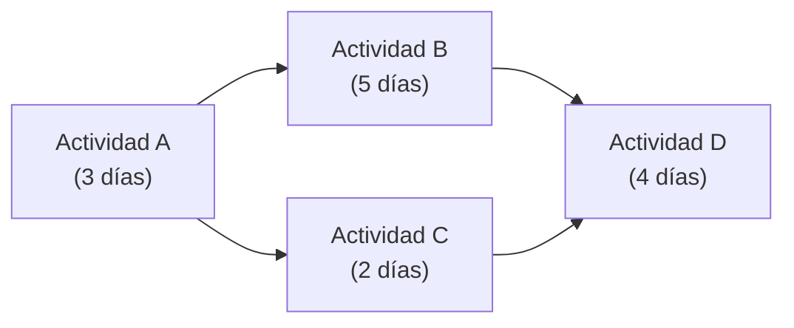

---
tags:
  - apuntes
  - duoc
  - sexto-semestre
  - gestion-de-proyectos
---

# 19 - 08 - 2026

## Cronograma

> [!CAUTION]
> La carta Gantt es solo una forma de hacer el cronograma; existen otras formas.

Asociamos el esquema EDT con el cronograma. El cronograma organiza las etapas del desarrollo de software, y el EDT define el alcance del mismo para asignar las tareas.

### Creación del Cronograma

Consiste en integrar:

- **Actividades:** tareas concretas a realizar.
- **Secuencia:** orden en que se ejecutan (dependencias entre actividades).
- **Recursos:**
  - **Tangibles:** material, tecnología, infraestructura.
  - **Personas:** grupo destinado a las distintas áreas.
- **Duraciones:** tiempo estimado para cada actividad.

Se hace un proceso iterativo considerando:

- Fechas de inicio y finalización.
- Planificación.
- Hitos: un hito puede ser un entregable, como un documento ERS.

### Dos pasos para estimar el cronograma

| Paso | Enfoque | Considera |
| --- | --- | --- |
| **Primera vez** | Versión pesimista | No incluye retrasos, adelantos ni dependencias; asume recursos ilimitados |
| **Segunda vez** | Versión más óptima | Sí incluye retrasos, adelantos y dependencias |

---

## Carta Gantt

> [!WARNING]
> La carta Gantt sirve para el nivel visual del cronograma, pero **no sirve para calcular la ruta crítica** del proyecto.

---

## Ruta Crítica (CPM)

> [!NOTE]
> La ruta crítica es la secuencia de actividades que afecta directamente la duración total del proyecto. Si una actividad se retrasa, todo el proyecto se retrasa.

**CPM** (Critical Path Method): método para identificar el camino más largo de dependencias que determina la duración mínima del proyecto.

### Diagrama de Red

El diagrama de red representa las actividades del proyecto como un grafo:

- Cada **caja** es una actividad.
- Las **flechas** indican dependencias entre actividades.
- Para cada actividad se definen: nombre, duración y predecesoras.

### Estimación por tres valores (PERT)

> [!NOTE]
> PERT (Program Evaluation and Review Technique) usa tres estimaciones para calcular la duración esperada de cada actividad.

| Estimación | Descripción |
| --- | --- |
| **Optimista (O)** | Tiempo mínimo si todo sale perfecto |
| **Más probable (M)** | Tiempo más realista bajo condiciones normales |
| **Pesimista (P)** | Tiempo máximo si hay problemas |

Fórmula PERT:

$$
t_e = \frac{O + 4M + P}{6}
$$

También sirve para hacer una **estimación de presupuestos**.

---

## Holguras

> [!NOTE]
> La holgura es el tiempo disponible entre las fechas de inicio y fin de una actividad sin afectar la duración total del proyecto.

Se calcula mediante el **backward pass** (recorrido inverso del diagrama de red):

1. Se calcula el **camino más largo** (ruta crítica) desde el inicio hasta el fin.
2. Para cada actividad no crítica, se resta su duración del tiempo disponible en su camino.
3. El resultado es la **holgura total** de esa actividad.

| Tipo | Descripción |
| --- | --- |
| **Holgura total** | Cuánto se puede retrasar una actividad sin atrasar el proyecto |
| **Holgura libre** | Cuánto se puede retrasar sin afectar a las actividades sucesoras |
