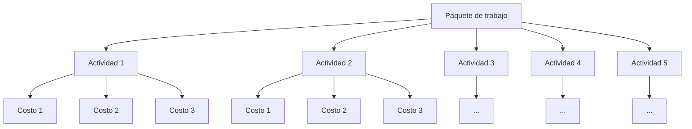
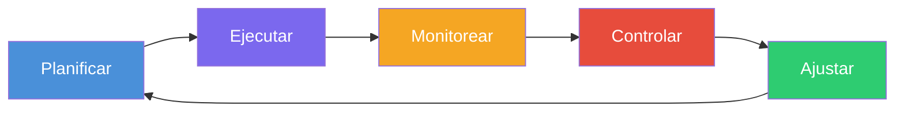

# 16 - 09 - 2026

## Cronogroma

solo las celdas con las **X** se rellenan.

- Entregable
  - Paquete de trabajo
    - Actividad 1-5

> [!tip]
> Reducir la EDT lo máximo posible. Cada paquete de trabajo (caja inferior de la EDT) suele descomponerse en ~5 actividades, y cada actividad arrastra ~3 ítems de costo asociados. Menos paquetes = menor sobrecarga de control y costeo.

## Costos del proyecto

- Claves para construir el presupuesto global del proyecto.
- Incluyen personas, materiales, herramientas y servicios.
- Se deben identificar todos los costos para cada una de las fases.

### Cómo hacer un presupuesto para un proyecto

1. Definir la Estructura de Desglose del Trabajo (EDT).
2. Especificar los detalles de las tareas.
3. Introducir los valores de costes.
4. Obtener los costos totales.
5. Tomar en cuenta contingencias y costos extra.
6. Obtener la aprobación.
7. Hacer seguimiento posterior.
8. Sacar conclusiones.

### Principales tipos de costo

- **Costos variables:** dependen del volumen de producción (ej. honorarios de consultores externos según horas contratadas).
- **Costos fijos:** no cambian con el volumen de producción (ej. sueldo mensual fijo independiente de las horas dedicadas al proyecto).
- **Costos directos:** atribuibles directamente al proyecto (ej. pasajes/viáticos para presentar el plan de dirección a la alta gerencia).
- **Costos indirectos:** benefician a varios proyectos; prorrateados o difíciles de asignar a uno solo (ej. gastos de estructura: contabilidad, luz, telefonía, PMO).
- **Costo de oportunidad:** valor de la mejor alternativa descartada al asignar un recurso. Se consideran salidas de caja y costos de oportunidad.
- **Costos hundidos (o enterrados):** costos ya devengados/ejecutados que no cambian con la decisión presente de continuar o cancelar el proyecto.

## Gestión de recursos

- Los recursos comprenden todo lo necesario para ejecutar el proyecto: equipo humano, herramientas/infraestructura, tiempo y presupuesto.

### Estimar los recursos de las actividades

Proceso donde se identifica tipo, cantidad y características de los recursos requeridos para completar cada actividad. Permite estimar costos y duraciones con mayor precisión.

### Estructura de Desglose de Recursos (RBS / EDR)

- Estructura jerárquica de **todos** los recursos (materiales y humanos), organizados por categoría y tipo.
- Especifica tipos y cantidades requeridas por actividad según el alcance definido.
- Documenta cantidad requerida y nivel de disponibilidad de cada recurso.

## Preguntas para reflexionar

1. **¿Qué elementos consideras más importantes en la planificación de un proyecto de software?**
   - Definición clara del alcance (evita scope creep), EDT bien estructurada, arquitectura técnica base, estimación realista de esfuerzo/recursos y reservas de contingencia para riesgos e imprevistos.

2. **¿Cómo podrías asegurar la precisión en la estimación de recursos?**
   - Descomponer hasta el nivel de actividad (estimación ascendente / bottom-up), basarse en datos históricos o proyectos similares (estimación análoga/paramétrica), consultar juicio de expertos técnicos y utilizar la Estructura de Desglose de Recursos (RBS/EDR) para no omitir infraestructura ni licencias.

3. **¿Qué desafíos podrías enfrentar al crear el cronograma y cómo los resolverías?**
   - **Dependencias ocultas:** mapear la ruta crítica (CPM) y validar dependencias obligatorias vs. discrecionales.
   - **Subestimación o sobreasignación de personal:** aplicar nivelación de recursos (*resource leveling*) y definir buffers de tiempo para mitigar variaciones.

4. **¿Qué tan claro quedó el alcance del proyecto?**
   - Queda validado cuando cada entregable tiene criterios de aceptación explícitos, está desglosado en paquetes de trabajo dentro de la EDT y cuenta con un diccionario de la EDT que define los límites (lo que incluye y lo que queda formalmente fuera).

5. **¿Identificamos todos los recursos necesarios?**
   - Se asegura cruzando cada actividad con categorías completas: equipo humano (roles, perfiles y horas), infraestructura/hardware, licencias/software, entornos (dev/qa/prod) y servicios externos/nube.

6. **¿Nuestro cronograma es realista y alcanzable?**
   - Sí, siempre que la asignación de horas contemple la dedicación efectiva (no 100% de la jornada laboral útil), las holguras no sean nulas en todas las ramas y las fechas finales coincidan con el análisis de la ruta crítica más reservas de contingencia.

7. **¿Supimos considerar los costos más relevantes en el proyecto?**
   - Sí, al balancear costos directos (sueldos del equipo de desarrollo, servidores específicos) e indirectos (servicios compartidos, administración), contemplar costos variables según demanda y apartar reservas de contingencia para riesgos técnicos conocidos.

> [!info] Esquema de trabajo Bottom-Up (Ascendente)
> Método de estimación y planificación donde el trabajo se descompone hasta el nivel más granular (tareas/actividades individuales con sus recursos y costos asociados).
>
> - **Mecánica:** Se estima el esfuerzo, duración y costo de cada actividad base; luego estos valores se agregan hacia arriba (Actividad $\rightarrow$ Paquete de trabajo $\rightarrow$ Entregable $\rightarrow$ Proyecto total).
> - **Ventaja:** Mayor precisión y compromiso técnico del equipo que ejecuta la tarea.
> - **Trade-off:** Requiere mayor tiempo inicial de análisis y una EDT madura antes de poder consolidar el presupuesto global.

## Monitoreo y Control en Proyectos de Software

- El **monitoreo** y **control** son procesos esenciales que permiten gestionar y supervisar el progreso de un proyecto de software.
- A través de ellos, se asegura que el proyecto avance según lo planificado, se identifican riesgos potenciales y se implementan acciones correctivas cuando es necesario.
- Estos procesos proporcionan una visión clara y en **tiempo real** del estado del proyecto, permitiendo tomar decisiones informadas.

### Ciclo de Monitoreo y Control

- **Planificar** — Definir objetivos, alcance, cronograma y recursos.
- **Ejecutar** — Implementar lo planificado.
- **Monitorear** — Recopilar datos del avance real vs. lo planificado.
- **Controlar** — Analizar desviaciones y determinar acciones correctivas.
- **Ajustar** — Aplicar cambios al plan según los hallazgos del control.

### La Importancia de los KPIs (Indicadores Clave de Rendimiento, Key Performance Index)

- Los **KPIs** son métricas fundamentales que miden el rendimiento del proyecto en diversas áreas, como el **tiempo**, el **costo**, la **calidad** y el **alcance**.
- Seleccionar KPIs adecuados es vital para asegurar que el proyecto esté alineado con los **objetivos organizacionales**.

> [!NOTE]
> Los KPIs siempre son **números** (porcentajes, cantidades, ratios), no descripciones cualitativas.
>
> - Se definen al menos **entre 3 y 5 KPIs** por proyecto.
> - Se miden a **ciclos regulares** y se presentan al **cliente**.
> - Se **definen** en la fase de **planificación** y se **miden** en la fase de **monitoreo y control**.

- Ejemplos de KPIs incluyen:
  - Porcentaje de cumplimiento de hitos.
  - Desviación del presupuesto.
  - Satisfacción del cliente.
  - Defectos por cada 1000 líneas de código.
