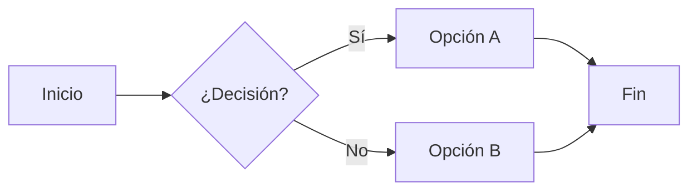
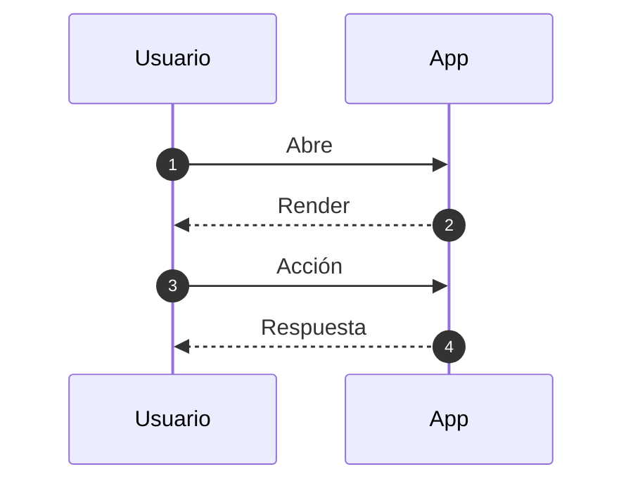

# Guía de Markdown (en Obsidian)

> [!sumary] 
> Referencia rápida y avanzada para escribir mejor, más rápido y con más poder dentro de mi bóveda.
>

---

## Índice

1. [Encabezados](#1-encabezados)
2. [Énfasis de texto](#2-énfasis-de-texto)
3. [Párrafos, saltos y líneas horizontales](#3-párrafos-saltos-y-líneas-horizontales)
4. [Listas (no ordenadas, ordenadas, anidadas)](#4-listas)
5. [Listas de tareas (checkbox)](#5-listas-de-tareas-checkbox)
6. [Citas (blockquotes)](#6-citas-y-anidación)
7. [Código inline y bloques + resaltado](#7-código-inline-y-bloques)
8. [Tablas](#8-tablas)
9. [Enlaces (externos e internos)](#9-enlaces-externos-e-internos)
10. [Imágenes e incrustaciones](#10-imágenes-y-atributos)
11. [Referencias, notas al pie y definiciones](#11-referencias-notas-al-pie-y-definiciones)
12. [Callouts / Admoniciones](#12-callouts--admoniciones-obsidian)
13. [Etiquetas (tags) y enlaces a bloques](#13-etiquetas-tags-y-enlaces-anclados)
14. [Diagramas Mermaid](#14-diagramas-mermaid)
15. [Tabla de contenido automática](#15-tablas-de-contenido-automáticas)
16. [Front matter (YAML)](#16-front-matter-yaml)
17. [Matemáticas (LaTeX)](#17-matemáticas-latex)
18. [Escape de caracteres especiales](#18-escape-de-caracteres-especiales)
19. [Comentarios y contenido colapsable](#19-comentarios-y-contenido-colapsable)
20. [Incrustar notas / bloques / multimedia](#20-incrustar-otros-archivos--bloques-específicos)
21. [Buenas prácticas](#21-buenas-prácticas-y-estilo)
22. [Ejemplo integrado final](#22-ejemplo-completo-integrado)

---

## 1. Encabezados

```md
# H1 Título principal
## H2 Sección
### H3 Subsección
#### H4
##### H5
###### H6
```


No saltes de H2 a H5 sin lógica: ayuda a accesibilidad.

## 2. Énfasis de texto

```md
*itálica*  _itálica_
**negrita**  __negrita__
***negrita + itálica***
~~tachado~~
==resaltado==  (Obsidian / plugins)
`código inline`
```

## 3. Párrafos, saltos y líneas horizontales

Salto suave = dos espacios al final de línea o `<br>`.

```md
Línea 1  ␠␠
Línea 2

---   <!-- regla horizontal -->
```

## 4. Listas

### No ordenadas

```md
- Item A
  - Subitem A.1
    - Subitem A.1.a
* También con asteriscos
+ O con signo más
```

---

### Ordenadas

```md
1. Paso uno
2. Paso dos
3. Paso tres

1. Puedes repetir 1. y se auto-numera
```

## 5. Listas de tareas (checkbox)

```md
- [ ] Pendiente
- [x] Hecho
  - [ ] Subtarea
```

En Obsidian se pueden buscar por estado; plugins añaden fechas, prioridades, etc.

## 6. Citas y anidación

```md
> Cita nivel 1
>> Cita nivel 2
>>> Cita nivel 3
```

Lista dentro de cita:

```md
> Nota:
> - Punto 1
> - Punto 2
```

## 7. Código inline y bloques

Inline: `sum(1,2)`

Bloques con lenguaje (resaltado):

````md
```python
def suma(a, b):
    return a + b
```
````

````md
```javascript
console.log('Hola');
```
````

Sin resaltar:

````md
```
texto literal
```
````

### Ejemplo (cronometrar script)

```python
import time

def tarea():
    time.sleep(0.3)

inicio = time.time()
tarea()
print(f"Duración: {time.time()-inicio:.3f}s")
```

## 8. Tablas

```md
| Col | Descripción            | Nota |
|----:|------------------------|:----:|
|  1  | Alineación derecha     | OK   |
|  2  | Por defecto (izq)      |      |
|  3  | Centrado               |  *   |
```

Escapa pipes internos con `\|`.

## 9. Enlaces externos e internos

```md
[Web](https://example.com)
<https://example.com>
[[Nota Interna]]
[[Nota Interna#Sección]]
[[Nota Interna#^id-bloque]]
```

Con título:

```md
[Obsidian](https://obsidian.md "Sitio oficial")
```

## 10. Imágenes y atributos

```md


```

Obsidian (no estándar):

```md
![[imagen.png|300]]      <!-- ancho -->
![[imagen.png|300x180]]  <!-- ancho x alto -->
```

## 11. Referencias, notas al pie y definiciones

### Enlaces por referencia

```md
Ver [Google][g] y [Obsidian][o].

[g]: https://google.com
[o]: https://obsidian.md
```

### Notas al pie

```md
Texto con nota.[^1]

[^1]: Detalle o fuente.
```

### Definiciones (algunos parsers)

```md
Markdown
: Sintaxis ligera de formato.
```

## 12. Callouts / Admoniciones (Obsidian)

```md
> [!info] Información
> Texto útil.

> [!warning] Advertencia
> Cuidado con...

> [!tip] Consejo
> Usa atajos.

> [!quote]
> Cita destacada.
```

## 13. Etiquetas (tags) y enlaces anclados

```md
#proyecto #idea #2025 #area/marketing #estado/hecho
```

Tags jerárquicos: `#tema/subtema`.

## 14. Diagramas Mermaid



Otros: `sequenceDiagram`, `gantt`, `classDiagram`, `stateDiagram`, `erDiagram`, `pie`.

## 15. Tablas de contenido automáticas

```md
[[toc]]
```

(Requiere soporte del entorno / plugin.)

## 16. Front matter (YAML)

```yaml
---
title: "Guía Markdown"
tags: [markdown, obsidian, referencia]
fecha: 2025-10-06

resumen: "Sintaxis esencial y avanzada"
---
```

## 17. Matemáticas (LaTeX)

Inline: `La energía $E = mc^2$`.

Bloque:

```md
$$
\nabla^2 \phi = 0
$$
```


## 18. Escape de caracteres especiales

Escapa con barra invertida: `\* \_ \# \| \[ \] \(`.

## 19. Comentarios y contenido colapsable

Comentario HTML:

```md
<!-- No se verá -->
```

Colapsable:

```html
<details>
  <summary>Ver más</summary>
  Contenido oculto.
</details>
```

## 20. Incrustar otros archivos / bloques específicos

```md
![[Nota Relacionada]]
![[Nota Relacionada#Sección]]
![[Nota Relacionada#^id-bloque]]
```

Imagen remota:

```md

```

## 21. Buenas prácticas y estilo

- Jerarquía lógica de encabezados
- Negritas para conceptos clave, no párrafos enteros
- Divide notas largas en módulos enlazados
- Usa YAML para metadatos (búsqueda, filtros)
- Tags específicos > genéricos (#tarea vs #misc)
- Revisa tablas en vista previa (alineación)
- Prefiere listas para pasos secuenciales
- Guarda ejemplos reutilizables como snippets

## 22. Ejemplo completo integrado

````md
---
title: "Ejemplo Completo"
tags: [demo, markdown]
---

# Proyecto Demo
> [!info] Resumen
> Demostración de múltiples elementos.

## Objetivos
- [x] Sintaxis básica
- [x] Bloques avanzados
- [ ] Añadir más luego

## Fórmula
$f(x)=x^2 + 2x + 1$

## Tabla
| Módulo | Estado | Nota |
|------- |:------:|-----:|
| Core   | ✅     | 100% |
| UI     | 🚧     |  70% |

## Flujo


## Referencias
Ver [Markdown][md] y [Obsidian][ob].

[md]: https://www.markdownguide.org
[ob]: https://obsidian.md
````

---

## **Admonitions** o Callouts

### Informativo y Neutros

Se utilizan para añadir contexto que no es vital para la tarea principal, pero que aporta valor.

>[!note] Nota
>Información  general o recordatorios

>[!info] Informacion
>Datos adcionales o aclaraciones

>[!todo] Tareas
>Pendientes o pasos a seguir dentro de un proceso


### Positivos y de Éxito

Ideales para resaltar soluciones, consejos o metas alcanzadas

>[!tip] Consejo
>Sugerencia para hacer algo de forma más eficiente

>[!hint] Consejo 
>Sugerencia para hacer algo de forma más eficiente

>[!success] Éxito
>Confirmaciones de que algo se ha completado correctamente

>[!check] Éxito
>Confirmaciones de que algo se ha completado correctamente


### Advertencias y Criticos

Diseñados para captar la atención de inmediato y evitar errores del usuario.

>[!warning] Advertencia
>Avisos sobre posibles problemas si no se tiene cuidado

>[!caution] Precaución 
>Similar a la advertencia, pero suele indicar un riesgo moderado

>[!danger] Peligro
>Errores critico, fallos del sistema o acciones irreversibles

>[!error] Peligro 
>Errores críticos, fallos del sistema o acciones irreversibles

### Otros Estilos Comunes 

>[!abstract] Resumen
>Una síntesis rápida del contenido 

>[!summary] Resumen
>Una síntesis rápida de contenido

>[!quote] Cita
>Para resaltar frases de autores o bloques de texto externos

>[!example] Ejemplo
>Casos prácticos para ilustrar un concepto

>[!question] Pregunta 
>Dudas comunes o secciones de ayuda

>[!help] Pregunta
>Dudas comunes o secciones de ayuda


## Próximos pasos sugeridos

- Crea una nota laboratorio para practicar
- Documenta un proceso real con secciones claras
- Explora plugins: Dataview, Templater, Advanced Tables, Calendar


