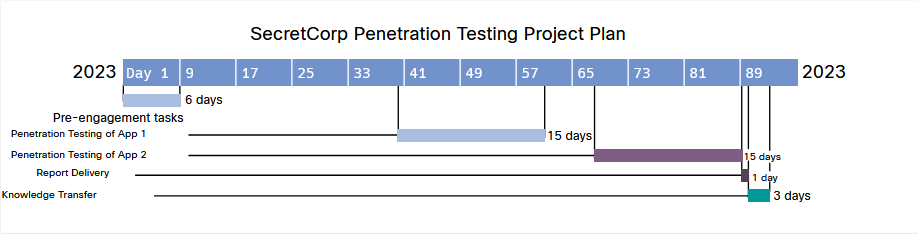

# 2.2.2 Reglas de compromiso

El **documento de reglas de participación** especifica las condiciones en las que se realizará la participación de pruebas de penetración de seguridad. Debe documentar y acordar estas condiciones de la regla de participación con el cliente o una parte interesada adecuada. La Tabla 2-3 enumera algunos ejemplos de los elementos que generalmente se incluyen en un documento de reglas de participación.

**_Tabla 2-3_** _-_ _Elementos de muestra de un documento de reglas de participación_

| Elementos de regla de participación | Ejemplo |
| :--- | :--- |
| Prueba de línea de tiempo | Tres semanas, como se especifica en un diagrama de Gantt |
| Ubicación de la prueba | Sede de la empresa en Raleigh, Carolina del Norte |
| Ventana de tiempo de la prueba (horas del día) | De 8:00 a. m. a 5:00 p. m. hora del este de los Estados Unidos |
| Método de comunicación preferido | Informe final y reuniones semanales de actualización de estado |
| Los controles de seguridad que potencialmente podrían detectar o evitar las pruebas | Sistemas de prevención de intrusiones (IPS), cortafuegos, sistemas de prevención de pérdida de datos (DLP) |
| Direcciones IP o redes desde las que se originarán las pruebas | 10.10.1.0/24, 192.168.66.66, 10.20.15.123 |
| Tipos de pruebas permitidas o no permitidas | Prueba solo de aplicaciones web (app1.secretcorp.org y app2.secretcorp.org). No se permiten ataques de ingeniería social. No se permiten ataques de inyección de SQL en el entorno de producción. La inyección de SQL solo se permite en los entornos de desarrollo y preparación en: app1-dev.secretcorp.org, app1-stage.secretcorp.org, app2-dev.secretcorp.org, app2-stage.secretcorp.org |

Los diagramas de Gantt y las estructuras de desglose del trabajo (WBS) se pueden usar como herramientas para demostrar y documentar la línea de tiempo. La Figura 2-1 muestra un ejemplo de diagrama de Gantt básico.

**_Figura 2-1_** _- Ejemplo de un diagrama de Gantt_

>[!hint]
>**PISTA** En el Módulo 1, aprendió otro documento que se usa con frecuencia y es importante para cualquier participación en pruebas de penetración como lo es el documento de permiso de prueba (o permiso de ataque). Puede ser un documento independiente o puede estar incluido con otros documentos, como el contrato principal.

