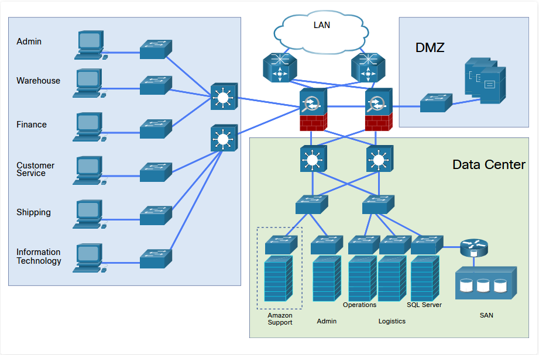

# Incompleto Práctica de laboratorio - Alcance y planificación previos al compromiso

## Topología

## # Tabla de direccionamiento: Centro de datos

| Servidores        | VLAN      | Dirección IP  | 172.16.33.0/30             |
| ----------------- | --------- | ------------- | -------------------------- |
| Administración    | 2 - 5     | 172.24.1.0/24 | (4) 255.255.255.192        |
| Soporte de Amazon | 10 - 25   | 172.25.0.0/16 | (11) 255.255.252.0         |
| Operaciones       | 50 - 55   | 172.26.0.0/21 | (5) 255.255.255.0          |
| Logística         | 80 – 85   | 172.27.0.0/21 | (5) 255.255.255.0          |
| Administración    | 100 - 110 | 172.30.0.0/16 | varios según sea necesario |

## # Tabla de direccionamiento: LAN

| Departamento                 | VLAN | Dirección IP | Máscara de subred |
| ---------------------------- | ---- | ------------ | ----------------- |
| Administración               | 120  | 172.16.1.0   | 255.255.255.0     |
| Subred de                    | 130  | 172.16.4.0   | 255.255.255.0     |
| Tecnología de la información | 140  | 172.16.8.0   | 255.255.255.0     |
| Depósito                     | 150  | 172.16.12.0  | 255.255.255.0     |
| Atención al cliente          | 160  | 172.16.16.0  | 255.255.255.0     |
| Envío                        | 170  | 172.16.20.0  | 255.255.255.0     |

# Trasfondo / Escenario

Se estableció contacto con su empresa para realizar una auditoría de seguridad para Nexus Plaza, una empresa minorista en línea. Se le ha asignado para ayudar al auditor líder a desarrollar el alcance del trabajo de prueba. Utilice el diagrama de red y la transcripción de la entrevista con el CEO de la empresa y el director de TI para completar la Hoja de trabajo del alcance.

**Entrevista con CEO y director de TI**

**CEO**: Bienvenido a Nexus Plaza. Lo invitamos a iniciar nuestro compromiso y analizar lo que esperamos de esta auditoría de seguridad. Estamos ansiosos por garantizar que nuestra infraestructura de seguridad cumpla o supere las salvaguardas necesarias. Le pasaré esto a nuestro director de TI para que describa nuestro entorno de red.

**Director de TI**: Como sabe, somos principalmente una empresa minorista en línea. Nuestros sitios de comercio electrónico orientados al cliente se alojan en Amazon, pero todas nuestras comunicaciones, almacenamiento y servicios de TI de envío se manejan internamente. Operamos un centro de datos local en Houston que respalda nuestras instalaciones de fabricación y almacenamiento. Actualmente hay 25 servidores separados en tres clústeres: administración, operaciones y logística. Además, operamos un clúster que brinda soporte para nuestra tienda de Amazon. El acceso remoto a estos sistemas se realiza a través de SSL o IPsec VPN. Usamos dos ISP para conectarnos a Internet, pero uno se usa principalmente para las comunicaciones con Amazon para admitir pedidos en tiempo real, inventario y contacto con clientes.

**CEO**: Recientemente, uno de nuestros competidores sufrió un ataque de ransomware dirigido a su sistema de inventario de producción. Perdieron una cantidad significativa de pedidos de clientes debido a que no podían recoger y enviar el inventario a tiempo. Nos preocupa que nuestros sistemas de depósito y envío puedan tener vulnerabilidades que podrían cerrarnos de manera similar si se produce una infracción. Cuando depende de una entrega rápida a los clientes, cualquier demora es un desastre.

**Director de TI**: Los sistemas que soportan nuestro almacenamiento y envío se encuentran en dos clústeres en el centro de datos: operaciones y logística. El acceso interno a estos sistemas está restringido al personal de administración del almacén, el personal de TI y los empleados de control de inventario. Nuestro sistema de control de inventario es compatible con una base de datos Microsoft SQL Server. Como puede ver en el diagrama, la base de datos SQL se aloja en una SAN separada con conexiones tanto al almacén como a los sistemas de producción. Nuestro negocio depende de nuestro acceso a Amazon; por lo tanto, ninguna prueba debe invadir los clústeres de centros de datos que contienen los datos y el inventario de la tienda de Amazon. Estos se identifican en el diagrama.

**CEO**: Queremos que pruebe los controles de seguridad para garantizar que un atacante que obtenga correctamente el acceso a una cuenta de usuario final y una computadora dentro del depósito no pueda obtener acceso de administrador a ninguno de los servidores o tener acceso al inventario de producción base de datos. También queremos asegurarnos de que el software y los sistemas operativos estén actualizados y que no haya vulnerabilidades conocidas en nuestras aplicaciones.

**Director de TI**: le brindaremos acceso interno a través de una VLAN aislada dentro del departamento de TI desde la que podrá realizar las pruebas. Hay un cortafuego con IDS integrado que separa las redes del centro de datos de la LAN corporativa, incluido el departamento de TI. Dentro del centro de datos, cada servidor tiene un cortafuego local habilitado. El DNS interno se proporciona a través de los servicios de Microsoft Active Directory y el DNS externo es un servidor Linux ubicado en una DMZ separada. El acceso externo a los clústeres de operaciones y logística se limita a los empleados que se conectan a través de VPN. No se permite el acceso HTTP a estos clústeres. Los servidores de estos dos clústeres no tienen acceso a Internet, excepto para obtener actualizaciones de software automáticas.

**CEO**: Debido a que los sistemas que queremos que pruebe son sistemas de producción, esperamos limitar al mínimo las interrupciones causadas por las pruebas. Le daremos acceso a un sistema de desarrollo Microsoft SQL Server que está configurado de manera idéntica al sistema de producción con un espejo de la base de datos.

**Director de TI**: Sí, quiero reforzar la necesidad de mantener las interrupciones al mínimo. Le daremos un intervalo de tiempo durante nuestro período de mantenimiento programado normal para realizar pruebas de carga y simulaciones de ataques de denegación de servicio. Nuestro período de mantenimiento programado es entre las 2:00 a. M. Y las 6:00 a. M. Los viernes, sábados y domingos. Se pueden ejecutar otras pruebas no disruptivas durante el horario comercial normal.

**CEO**: Estamos limitando la cantidad de personal de TI que está al tanto de las pruebas. Solo se notificará al personal de TI directamente responsable del monitoreo de las operaciones y los sistemas de logística cuando se realizarán las pruebas. Proporcionaremos una lista de direcciones de correo electrónico del personal de operaciones y depósitos, ya que nos preocupa que la mayoría de los ransomware y las infracciones de datos comiencen con un ataque de ingeniería social exitoso. Los usuarios finales no se darán cuenta de que se están realizando las pruebas. Esperamos que el compromiso comience dos semanas después de la firma del contrato y el acuerdo de confidencialidad. Esperamos el informe final en un plazo de 60 días.

Sus contactos principales para esta interacción son el director de TI, el gerente de depósito y el gerente de operaciones. Programe un informe de actualización semanal y una teleconferencia para informarles sobre el progreso de las pruebas y los resultados intermedios.

# Instrucciones

## Parte 1: Determine el alcance del compromiso

### Paso 1: Analice la información obtenida del cliente.

1. Revise la información obtenida en la entrevista con el CEO y el director de TI del cliente.
2. Identifique los puntos que influyen en el alcance del proyecto y las reglas para entablar combate.

### Paso 2: Complete la hoja de trabajo del alcance.

Utilice la información que identificó en la transcripción de la entrevista para completar la Hoja de trabajo del alcance.

## **Hoja de trabajo del alcance**

Para determinar el alcance y las reglas de participación del proyecto de pruebas de penetración, responda las preguntas en función de los resultados del análisis de la entrevista.

1. ¿Cuáles son las mayores preocupaciones de seguridad del cliente? (Los ejemplos incluyen la divulgación de información confidencial, la interrupción del procesamiento de producción, la vergüenza debido a la desfiguración del sitio web, etc.)

Que los sistemas de inventario y envío pueden estar sujetos a ataques de ransomware y que la empresa no podrá cumplir con los pedidos de manera oportuna.

2. ¿Qué clústeres de servidores, rangos de direcciones de red o aplicaciones específicos deben probarse?
Los servidores de los clústeres de operaciones y logística. Rangos de direcciones IP 172.26.0.0/21 y 172.27.0.0/21. Las aplicaciones de Microsoft SQL Server.

3. ¿Qué clústeres de servidores, rangos de direcciones de red o aplicaciones específicos NO deben probarse explícitamente?

Los clústeres de servidores de administración y soporte de Amazon, y los rangos de direcciones IP de la LAN.

4. ¿La prueba se realizará en un entorno de producción en vivo o en un entorno de prueba?
La mayoría de las pruebas se realizarán en sistemas de producción. Solo se realizarán pruebas intrusivas de SQL Server en sistemas de desarrollo.

5. ¿La prueba de penetración incluirá pruebas de red internas? Si es así, ¿cómo se obtendrá el acceso?

Sí, el acceso se proporcionará a través de una VLAN aislada en la red interna.

6. ¿Los sistemas de cliente / usuario final se incluyen en el alcance? Si es así, ¿cómo se aprovecharán los clientes?
No, los sistemas de usuario final del cliente no están en el alcance.

¿Está permitida la ingeniería social? Si es así, ¿es limitado?

Sí, está permitido, pero se limita a una lista específica de direcciones de correo electrónico.

¿Se permiten la denegación de servicio y otros ataques disruptivos? Si es así, ¿hay límites respecto de cuándo se pueden realizar las pruebas disruptivas?

Sí, se pueden intentar ataques disruptivos durante un intervalo de tiempo programado durante los períodos de mantenimiento normales.

¿Existen dispositivos que puedan afectar los resultados de una prueba de penetración? De ser así, ¿cuáles?

Sí, existen dispositivos de seguridad, incluidos cortafuegos y sistemas IDS.

7. ¿Probar el acceso inalámbrico es parte de este compromiso?
No, el acceso inalámbrico está fuera del alcance.

8. ¿Los servicios web están incluidos en el alcance de las pruebas?
No, los servicios web no están incluidos en el alcance de las pruebas.

9. ¿Los empleados conocen las pruebas y el plazo en que se realizarán?
No, solo los administradores y el personal de TI seleccionados conocen la prueba y el plazo.

10. ¿Dónde se encuentra físicamente el centro de datos del cliente?
El centro de datos está ubicado en Houston.

## Parte 2: Determine las reglas del compromiso

### Paso 1: Revise la información de la hoja de trabajo del alcance.

Usar la transcripción de la entrevista y la información de la Hoja de trabajo del alcance para completar la tabla de Elementos de las Reglas para participar.

|Reglas de los elementos del compromiso.|Valor|
|---|---|
|Prueba de línea de tiempo|Comience en dos semanas, informe en 60 días|
|Ubicación de la prueba|Instalaciones de Houston|
|Ventanas de tiempo para la prueba (horas del día)|Pruebas no invasivas durante el horario comercial   Pruebas invasivas durante el horario de 2 a 6 a. M. De viernes a domingo|
|Método de comunicación preferido|Informes o teleconferencias|
|Controles de seguridad que potencialmente podrían detectar o evitar las pruebas|Cortafuegos e IDS implementados|
|Manejo de datos sensibles|Acuerdo de confidencialidad firmado|
|Direcciones IP o redes desde las que se originarán las pruebas|VLAN interna del departamento de TI|
|Tipos de pruebas permitidas o no permitidas|Pruebas limitadas a servidores de operaciones y logística. Pruebas de SQL limitadas al entorno de desarrollo. Ingeniería social limitada a las direcciones de correo electrónico proporcionadas.|
|Contactos del cliente|Gerente de almacén, director de TI, gerente de operaciones|

## Responda las siguientes preguntas después de completar la 